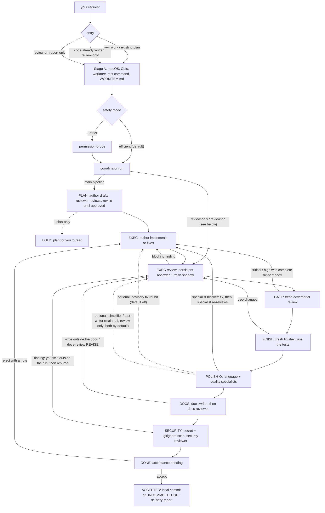

# review-loop

A Claude Code and Codex plugin that drives a work item through the paired-session coordinator: an author and an
independent reviewer plan and implement it, an adversarial gate checks the result, then finish, quality polish, docs
and security run, and nothing is delivered until you accept.

## Quick Start

```
/plugin marketplace add NYTC69/review-loop
/plugin install review-loop@review-loop-marketplace
```

Start a new session. The `/review-loop` command is now available in all your projects.

**Requirements (default entry).** macOS only (Linux is not supported for now; ADR-15 amendment); `claude` and
`codex` on PATH (codex-cli 0.159.2 or later); a dedicated git worktree for the task and a test command; an
interactive session (a headless session needs `--detach`); one absolute `CODEX_HOME` per run.

From v2.10.0 a fresh `/review-loop <work item>` without an `entry` key in
`.review-loop/config.md` hands off to the paired-session coordinator (the default
entry; since v2.13.0 `entry: legacy` is refused and nothing falls back to legacy), and
`/review-loop:paired-session <work item>` is the explicit entry. See
[`docs/paired-session-migration.md`](docs/paired-session-migration.md).
The legacy workflow was removed in v2.13.0 (routing) and v2.13.1 (`/review-loop:legacy`, `/review-loop:plan`,
`/review-loop:execute`, the Codex plan and execute skills and the legacy protocol files): plan-only work is
`/review-loop:paired-session <work item> --plan-only`, and an existing plan or a review of existing code is
`/review-loop` (see the migration guide).
Workspace `.review-loop/paired-session.json` may contain non-program limits only.
Keep role, vendor, program and test-command settings in an operator-owned profile
outside the product workspace and run directory, then pass its absolute path with
`--config` to every command (probe and run in strict mode); the paired-session skill uses
`~/.config/review-loop/paired-session.json` when it exists and you name no other
profile, and that profile replaces the workspace file. The plugin
ships `paired_session/paired-session-config.example.json` for that profile.

**Safety modes (D-EFF).** Every role runs with the same OS sandboxes in both
modes. `efficient`, the default, does not require a permission-probe PASS before
dispatch, and its evidence guard only records what it would have held. `strict`
(`--strict`, or `"safety_mode": "strict"` in the operator profile; the
workspace file cannot set it) also requires the probe PASS and lets the evidence
guard hold. The first command that creates the run (`run` by default,
`permission-probe` in strict mode) fixes its mode, so pass `--strict` from that
first command on; a `--strict` that
arrives after only the probe has run still upgrades the run, later it is
refused. Runs made before this change resume strict. In both modes a reviewer
turn that changes the workspace is voided, restored and re-dispatched once (a
second change or a failed restore is a HOLD), and an author turn that changes
HEAD or the branch is a HOLD. See
[`paired_session/docs/efficient-mode.md`](paired_session/docs/efficient-mode.md).

**Optional** — copy the config template and uncomment only the keys you change (every key is commented out at its default):

```bash
mkdir -p .review-loop
cp ~/.claude/plugins/cache/review-loop-marketplace/review-loop/<version>/review-loop-config.example.md .review-loop/config.md
```

> **After updating the plugin** — Claude Code caches plugins at session
> start. After `/plugin update`, exit with Ctrl-C twice and `claude --resume`
> to reload plugins while keeping your conversation context. This is a
> Claude Code caching behavior, not a review-loop limitation.

## Codex

Codex installs the same plugin (below) with four skills under `.agents/skills/`: `review-loop`, `guide`,
`paired-session` and `review-pr`. They run the same coordinator and read the same `.review-loop/config.md` as
Claude Code. The rest of this README documents the Claude Code commands; on Codex, ask in natural language
("run review-loop on this branch", "review the pending changes", "use paired-session for this task").
The legacy Codex Stage 1 workflow (its plan and execute skills, the Claude CLI reviewer launcher and the
`codex_reviewer_backend` / `codex_reviewer_model` / `codex_executor_model` keys) was removed in v2.13.0-v2.13.1;
the paired-session coordinator dispatches every role.

Codex has no code-quality-loop or reorganize skill; ask review-loop to review an existing change (a review-only
run, quality writers on).

### Install in Codex CLI

review-loop ships a Codex marketplace manifest at
`.agents/plugins/marketplace.json` plus a `plugins/review-loop` symlink so
the repo installs as a first-class Codex plugin (visible in `/plugins`,
parallel to the Claude Code plugin install at the top of this README).

```bash
codex plugin marketplace add NYTC69/review-loop
codex plugin add review-loop@review-loop-marketplace
```

Then, inside a fresh Codex session:

```
/plugins
```

The CLI install command above is sufficient; `/plugins` is an optional UI for
inspecting the installed plugin and its skills.

The plugin is cached under `$CODEX_HOME/plugins/cache/` (default
`~/.codex/plugins/cache/`). The paired-session skill reads the installed plugin
version from `codex plugin list --json` rather than assuming a fixed versioned
path.

Once enabled, the four skills under `.agents/skills/` (`review-loop`,
`guide`, `paired-session`, `review-pr`) are exposed to the Codex agent and respond to
natural-language triggers like "run review-loop on this branch" or
"use paired-session for this task". Codex matches plugin skills by their
`SKILL.md` `description`, not by literal slash commands —
`/review-loop:paired-session` etc. are Claude-only and surface as `Unrecognized` in
Codex.

A fresh review-loop request hands off to the coordinator by default from
v2.10.0; ask Codex to "use paired-session for this task" to name it explicitly
(a request for "the legacy review-loop workflow" is refused: the legacy workflow was removed in v2.13.0).
It reads non-program workspace defaults from `.review-loop/paired-session.json`
when no `--config` is given; the skill passes `~/.config/review-loop/paired-session.json`
as `--config` when that file exists and you name no other profile. Program and role settings require an external operator
profile passed with `--config`, which replaces rather than layers onto the workspace profile.
Run artifacts stay outside the product workspace under
the user-level Codex state folder.

Full step-by-step + verification: [`docs/install-codex.md`](docs/install-codex.md).

## Reviewer isolation and invocation evidence

Report-only reviewers and specialists are dispatched by the paired-session coordinator as fresh
reviewer-role turns (the legacy launchers were removed in v2.13.1); see the
[reviewer runtime contract](docs/protocol/reviewer-runtime.md). The
[delivery manifest](docs/protocol/delivery-scope.md) identifies HEAD/index/worktree and pre-existing user
changes without staging or committing.

## Contributing: how the skills load their instructions

The entry skills load their instructions by action: the [loading contract](docs/protocol/loading.md) and its map
(`docs/protocol/loading.json`) select the exact shared-protocol text, which `scripts/read_protocol.py` emits. Within a
live context unchanged text is not delivered again; new agents and resumed or compacted contexts reload it. The
review-loop skills keep their entry procedures under `references/`.

## Skill Tests

The repository includes a first-version skill testing framework for
`review-loop` and `guide`.

- `scripts/run-skill-lint` runs static contract checks (the legacy smoke suite was removed in v2.13.1)

Test output uses `PASS`, `FAIL`, and `SKIP`.

- Aggregate results: `tests/skills/.last-run.json`

Script tests run with `python3 -m pytest tests`; explicitly naming `tests` avoids
recursively collecting the plugin's repository symlink. The coordinator's tests run with
`python3 -m unittest discover -s paired_session -p 'test_*.py'` (fake CLIs only; no provider is called).

## Claude Plugin Surface

The commands, configuration table and included agent list
below describe the current Claude Code plugin surface. `.review-loop/config.md` and the agents apply on Codex too,
through its four skills (`review-loop`, `guide`, `paired-session`, `review-pr`).

## The `/review-loop` entry

- **`/review-loop`** — the entry. Fresh work goes to the paired-session
  coordinator and code already implemented to a paired-session review-only run (`run --review-only`);
  an existing plan becomes the work item (PLAN drafts and reviews it again); resuming a legacy session is
  refused. `/review-loop:plan` and `/review-loop:execute` (with `--stop-after` and
  `--accept-external-state`) were deleted in v2.13.1: plan-only work is
  `/review-loop:paired-session <work item> --plan-only`.

## How a run goes

`--lifecycle-mode off` is the supported stop-after-gate route: PLAN -> EXEC -> GATE -> DONE (acceptance pending). The operator then handles FINISH, POLISH-Q, docs, security review and merging. Accept never commits on this route: it hands back the uncommitted tree. New runs default to `on` (the full lifecycle); CLI, operator/workspace profiles and Python entry points may select `off`, and saved off runs resume, accept, reject, note and abort normally.

```
/review-loop <work item>
│
├── PLAN       the author drafts a plan → an independent reviewer reviews it → revise until approved
├── EXEC       the author implements → the reviewer and a fresh shadow reviewer review → fix until approved
├── GATE       a fresh adversarial gate checks the approved change
├── FINISH     a fresh finisher runs the tests and fixes only what blocks delivery inside the plan
├── POLISH-Q   read-only specialists: language reviewers by file type, code-reviewer, silent-failure-hunter,
│              pr-test-analyzer (plus the simplifier and test consolidation when the quality writers are on)
├── DOCS       a docs writer brings the docs in line and adds the run's entry to the docs file; a reviewer checks it
├── SECURITY   a secret and .gitignore scan, then a fresh security reviewer
└── DONE       acceptance pending: you accept or reject
```

In PLAN a blocking finding goes back to the author for the next plan round. From EXEC on, a blocking finding of the
reviewer, the shadow or the gate goes back to the author; FINISH fixes what blocks delivery in its own session; a
FINISH or POLISH-Q fix, a DOCS write outside the docs or a DOCS-review REVISE opens a new EXEC round (the reviewer
first, then the gate). A SECURITY finding is a HOLD, never repaired by the run: fix it outside the run and resume
(the EXEC review and the gate run again).
A review of existing code (`run --review-only`) has no PLAN: its EXEC review of the change is round 1.
None of the review roles shares the author's session: the reviewer keeps its own session across rounds, and the
shadow, the gate and the stage reviewers start fresh each time. Default roles: Codex is the author
and the gate (`gpt-6.1-sol`), Claude the reviewer and the shadow (`claude-opus-5-5`); the operator profile changes
roles and models.

The same flow as a diagram (every arrow back means the change is reviewed again; dotted arrows are optional steps):



A review-pr run follows EXEC review, shadow, GATE, POLISH-Q and SECURITY to REPORTED: no PLAN, author fixes, FINISH, quality writers, DOCS or acceptance.

## Ending a run

A run ends at **DONE** (acceptance pending) or at a **HOLD** (it stopped and says why). Nothing is delivered at DONE:
- **accept** — only on your explicit decision. The agent accepts the tree that passed SECURITY and shows the delivery
  report it writes, `delivery-report.md` in the run directory (in Chinese: the stages, the commit, the finding counts
  by severity and final status with the ids still open, the rounds, the verdicts and the token totals). A review-only run (`/review-loop`
  on existing code, code-quality-loop) makes one local commit by default when its commit checks pass (otherwise the
  change stays uncommitted and `accept` lists the files to commit yourself); `auto_commit: false` in
  `.review-loop/config.md` keeps it uncommitted. The main pipeline commits only when the operator profile sets
  `auto_commit`. Nothing is ever pushed.
- **reject** — with your note, the run reopens EXEC and the author works on it.
- Under `handsfree` the agent never accepts or rejects.

## Run control

The coordinator prints one progress line per event (the role, its verdict and the open finding ids) and logs it to
`progress.jsonl` in the run directory. Ask the agent at any time:
- for the run's status (`status --brief`: the latest progress lines, without disturbing the run);
- to resume after a HOLD, once you have answered or fixed what it names; at a PLAN or EXEC round-limit HOLD,
  `resume --add-rounds N` (1-10) continues the same run with N more rounds of that phase;
- to abort the run (`abort`).
A headless session starts the run with `--detach` (the command returns at once with its pid and log; `stop` ends it).

## Example: Rust repo

```
/review-loop add rate limiting to the upload endpoint using tower middleware
```

**PLAN** — The author drafts a plan using `tower::limit::RateLimitLayer`. The reviewer flags a missing per-IP bucket
strategy as blocking; the author revises and the reviewer approves on round 2.

**EXEC** — The author implements the plan. The reviewer catches that `RateLimitLayer` was applied globally instead of
per route, a deviation from the approved plan; the author fixes it, and the reviewer and the shadow approve.

**GATE to SECURITY** — The gate finds nothing blocking. In POLISH-Q, `rust-reviewer` checks the change and
`pr-test-analyzer` notes a missing test for the 429 response; the author adds it, and the EXEC review and the gate run
again. DOCS adds the run's entry to `CHANGELOG.md`; SECURITY finds no secret and full `.gitignore` coverage.

**DONE** — You accept; the agent shows the delivery report. The change stays uncommitted unless the operator profile
sets `auto_commit`.

## Standalone Tools

### `/review-loop:code-quality-loop`

A paired-session review-only run on the uncommitted change (review, fix,
one fix round for the non-blocking findings, simplify, consolidate tests, docs, security; `accept` makes one local commit unless `auto_commit: false`).
Argument: `[max-rounds]`, an integer of at least 2 (round 1 reviews the existing change), which becomes
`--max-exec-rounds` and wins over `soft_limit_exec`. `--skip-reorganize` is accepted and has no effect;
`--reorganize`, `--legacy` and `entry: legacy` are refused (run `/review-loop:reorganize <files>` after the run).

### `/review-loop:reorganize <file/dir or 'diff'>`

Restructure code files: rearrange module layout, extract shared logic, remove
redundancy, add section comments. Splits coupled files into focused modules.
Preserves all functionality — this is restructuring, not rewriting.

```
/review-loop:reorganize src/engine.go    # single file
/review-loop:reorganize src/core/        # directory
/review-loop:reorganize diff             # all uncommitted changes
```

### `/review-loop:review-pr [PR number|PR URL|ref] [aspects]`

Reviews a change and writes a report; it never fixes, commits, pushes or posts on its own. The input is optional:
none reviews the local change in the current worktree; a PR number or GitHub PR URL (needs `gh`) or a ref is
reviewed in a temporary clone under the run root (your checkout is never touched; the clone is removed only when
you agree). No tests run unless you confirm a test command for this review. The EXEC reviewer, the shadow, the gate,
the language reviewers for the changed file types and the security stage run by default (`shadow: off` in the
operator profile skips the shadow, `skip_quality_polish: true` every specialist, the language reviewers included);
the aspects only choose the specialists below and never the language reviewers (`all` or none: every one that applies; `comments` runs when the change touches docs or comment
lines, `types` when it touches a type-bearing file). The result is `review-report.md` in the run directory, shown
when the run ends (REPORTED). Posting it as one `gh pr review --comment` is a separate request: the report is
scanned for secrets first, and the exact command and the full body are shown for a second confirmation.
`simplify` is a writer and is refused (run `/review-loop:code-quality-loop` on the change); `parallel` does not
apply. Available aspects:

| Aspect | Agent | What it checks |
|--------|-------|---------------|
| `code` | code-reviewer | Style, patterns, best practices |
| `errors` | silent-failure-hunter | Swallowed errors, silent fallbacks |
| `comments` | comment-analyzer | Comment accuracy, staleness |
| `types` | type-design-analyzer | Type design, encapsulation |
| `tests` | pr-test-analyzer | Test coverage, edge cases |

```
/review-loop:review-pr                      # the local change
/review-loop:review-pr 123 code tests       # PR #123 of this repository, two specialists
```

### `/review-loop:guide`

Show the usage guide — how it works, commands, configuration, and key features.

## Configuration

Project review settings live in `.review-loop/config.md` (every field optional; the table below). Operator
settings live in the operator profile (the one you name, else `~/.config/review-loop/paired-session.json`):
roles, vendors, models and efforts, the test command, `safety_mode`, `auto_commit` for the main pipeline,
`quality_writers`, `advisory_fix_round`, `max_invocations` and timeouts.
The CLI option `--lifecycle-mode on|off` defaults to `on`; the JSON profile key
`lifecycle_mode` may select `off` in an operator or workspace profile. With off,
DONE follows gate approval and `accept --auto-commit false` returns the uncommitted tree. The values in
`paired_session/paired-session-config.example.json` are examples, not the defaults (without a profile the gate
uses the author's vendor, and the test command is the one the skill confirms with you).

| Key | Default | Description |
|-----|---------|-------------|
| `entry` | absent = `paired-session` | `paired-session` (exact value); `legacy` is refused since v2.13.0; anything else is warned about and treated as absent |
| `soft_limit_plan` | `3` | `--max-plan-rounds`: the PLAN round cap; at the cap the run HOLDs and `resume --add-rounds N` continues it |
| `soft_limit_exec` | `4` | `--max-exec-rounds`: the same for EXEC |
| `auto_commit` | `false` | Not applied on the main pipeline: paired-session reads `auto_commit` from the operator profile and prints a warning when `auto_commit: true` is set here. Review-only runs (`/review-loop` on existing code, code-quality-loop) default to `true`: one local commit at `accept` with lifecycle on, never a push; lifecycle off returns the uncommitted tree; both honour an explicit `auto_commit: false` here |
| `docs_file` | `CHANGELOG.md` | File to append delivery summary; `""` to skip |
| `handsfree` | `false` | Nobody answers questions: a stage A question fails the entry, and `accept` / `reject` are never run |
| `review_focus` | `""` | Project-specific review priorities (free text); paired-session: `--review-focus` (L105), frozen at run start, for the reviewer, shadow and gate |
| `quality_focus` | `""` | Paired-session: `--quality-focus` (L105), frozen at run start, for the POLISH-Q specialists |
| `review_style` | `""` | Tone and rules for all reviews (free text); paired-session: `--review-style` (L105), frozen at run start, for every review role |
| `skip_quality_polish` | `false` | `true` skips the POLISH-Q specialists and the quality writers; docs and security still run |

`reviewer_model` and `executor_model` are not applied: set to anything other than empty or `inherit`, they
print a warning; models come from the operator profile. The legacy-only keys `reviewer`, `judgment_model`,
`cheap_model`, `codex_reviewer_backend`, `codex_reviewer_model`, `codex_executor_model`,
`commit_message_prefix`, `cross_vendor_review`, `adversarial_gate_skip_paths` and `context_persist_threshold`
were removed with the legacy workflow and have no effect.

### Natural language config examples

```yaml
review_focus: |
  - Security: auth checks, input validation, SQL injection
  - Performance: N+1 queries, missing indexes

quality_focus: "strict clippy lints, skip comment analysis"

review_style: "be terse, flag any unwrap() as CRITICAL"
```

## Included Agents

| Agent | Role |
|-------|------|
| `executor` | Implements plans and code changes as a sub-agent |
| `reviewer` | Independent adversarial reviewer (plan + code review) |
| `code-reviewer` | Style, patterns, and best-practice checks |
| `code-simplifier` | Removes unnecessary complexity while preserving behavior |
| `silent-failure-hunter` | Finds swallowed errors, silent fallbacks, inadequate error handling |
| `pr-test-analyzer` | Reviews test coverage quality and completeness |
| `comment-analyzer` | Checks comment accuracy, staleness, and maintainability |
| `type-design-analyzer` | Analyzes type design — encapsulation, invariants, usefulness |
| `go-reviewer` | Go static analysis (`go vet`, `staticcheck`, etc.) |
| `rust-reviewer` | Rust static analysis (`cargo clippy`, etc.) |
| `python-reviewer` | Python static analysis (`ruff`, `mypy`, etc.) |
| `frontend-security-reviewer` | Frontend security: XSS, CSRF, auth state, dependency risks |

## Key Design Features

**Live progress** — The coordinator prints one line per event (the role, its verdict and the open finding ids)
and logs it to `progress.jsonl` in the run directory; `status --brief` shows the latest.

**Plan Conformance** — In EXEC the reviewer and the shadow review the change against the approved plan, and an
EXEC approval needs their own run evidence (`self_run_evidence`; a review-pr report run without a test
command may approve statically).

**Secret scan** — On every route, `--lifecycle-mode off` included, the coordinator scans the lines the change adds
for hardcoded credentials (JWTs, `sk-` / `sk-ant-` / `sk-proj-` keys, AWS key ids, GitHub, Slack, Google and Stripe
live tokens, private-key blocks, and a key/secret/token/password name given a long random-looking quoted literal)
before each EXEC review verdict and before the gate. A hit is a blocking finding for the author that names only
`path:line` and the rule, never the value; with no EXEC round left the run holds, and a review-pr report lists it.
Exempt a deliberate test fixture with a `secret-scan-allow: <path or glob>` line in the work item (one per line).
The rules are one table (`scripts/content_rules.py`) with a scope per rule: the SECURITY stage scans the whole
delivery, files the run never touched included, with only the six rules it always had (private-key blocks, AWS key
ids, GitHub, Slack, Google and Stripe live tokens), and the marker does not exempt those; the JWT, `sk-` and
key-named-literal rules apply only to lines the run adds and to a review-pr post body.

**Run Directory** — Each run's state, evidence, findings ledger, usage and reports live in its run
directory outside the workspace; legacy `.review-loop/sessions/` files are left on disk and never read.

**Round Caps** — Hard round caps (plan 3 / exec 4 unless set) end in a HOLD; at that HOLD
`resume --add-rounds N` continues the same run (L100).

**Quality Polish (POLISH-Q)** — After the gate and FINISH, read-only specialists review the change: the language
reviewers for the changed file types (`go-reviewer`, `rust-reviewer`, `python-reviewer`,
`frontend-security-reviewer`) plus `code-reviewer`, `silent-failure-hunter` and `pr-test-analyzer`. The quality
writers (a fresh simplifier, then test consolidation) are on by default for review-only runs and
code-quality-loop, and off on the main pipeline (turn them on with the operator setting `quality_writers` or
`--quality-writers both`, about +10 invocations); a writer's change is kept only when the tests pass and the reviews
approve it again, otherwise it is rolled back with the reason. The advisory fix round (`advisory_fix_round`,
`--advisory-fix-round true`; code-quality-loop turns it on) gives the author one round for the open non-blocking
findings after the first clean POLISH-Q. Tune with `quality_focus` and `skip_quality_polish` (which skips the
specialists and the writers).

## File Structure

```
review-loop/
├── bin/paired-session            ← The coordinator CLI
├── paired_session/               ← The coordinator (coordinator.py and helpers), its tests, the operator reference
│   ├── README.md                 ← Operator reference for the coordinator CLI
│   ├── paired-session-config.example.json   ← Example operator profile
│   └── docs/                     ← Coordinator design notes
├── scripts/                      ← read_protocol.py, delivery_scope.py, security_preflight.py, materialize_pr.py,
│                                   the default gate prompt, run-skill-lint
├── docs/
│   ├── protocol/                 ← Shared protocol docs (single source of truth)
│   │   ├── loading.md / loading.json   ← Protocol loading contract and map
│   │   ├── paired-session-entry.md     ← Shared paired-session entry contract
│   │   └── reviewer-runtime.md / delivery-scope.md / loading-special-cases.md
│   ├── install-codex.md          ← Codex install and triggers
│   ├── paired-session-migration.md   ← From the legacy workflow to paired-session
│   └── history/                  ← Historical design and plan documents
├── .claude-plugin/               ← Claude Code plugin and marketplace manifests
├── .codex-plugin/plugin.json     ← Codex plugin manifest
├── .agents/
│   ├── skills/                   ← The four Codex skills
│   └── plugins/marketplace.json  ← Codex marketplace manifest
├── plugins/review-loop -> ..     ← Symlink the Codex marketplace resolves to the repo root
├── skills/
│   ├── review-loop/
│   │   └── SKILL.md              ← Entry: routes to paired-session
│   ├── paired-session/
│   │   └── SKILL.md              ← Paired-session coordinator entry
│   ├── code-quality-loop/
│   │   └── SKILL.md              ← Review-only paired run on the uncommitted change
│   ├── reorganize/
│   │   └── SKILL.md              ← Code file restructuring
│   ├── review-pr/
│   │   └── SKILL.md              ← Paired-session report mode (a PR, a ref or the local change)
│   └── guide/
│       └── SKILL.md              ← Usage guide
├── agents/
│   ├── executor.md                     ← Executor sub-agent
│   ├── reviewer.md                     ← Adversarial Reviewer
│   ├── code-reviewer.md                ← Code style + patterns
│   ├── code-simplifier.md              ← Complexity reduction
│   ├── silent-failure-hunter.md        ← Error handling review
│   ├── pr-test-analyzer.md             ← Test coverage review
│   ├── comment-analyzer.md             ← Comment quality review
│   ├── type-design-analyzer.md         ← Type design review
│   ├── go-reviewer.md                  ← Go static analysis
│   ├── rust-reviewer.md                ← Rust static analysis
│   ├── python-reviewer.md              ← Python static analysis
│   └── frontend-security-reviewer.md  ← Frontend security
├── review-loop-config.example.md ← Copy to .review-loop/config.md, uncomment what you change
├── .gitignore
├── LICENSE                       ← Apache 2.0
└── README.md
```

## License

Apache 2.0
